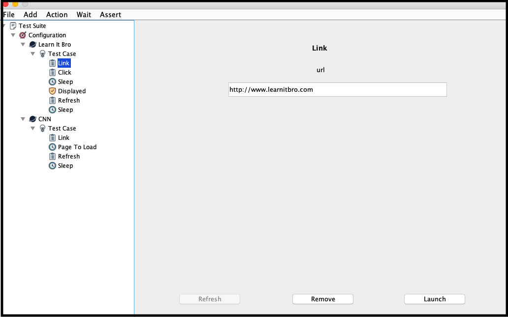

# Testing Tool

### Description: 
It allows to test any website

### Summary:
This tool allows to create Selenium tests using a user interface in JAVA

### Steps:
Using the user interface:
- Run the jar file
- Add test steps
- Press Launch
- The test will start and a report will be send to the email provided

Using the terminal or jenkins:
- Run the jar file and pass the json tree as a parameter
- Example: java -jar tool.jar tree.json
- The file will include the browser, test cases and all information the test needs
- Press Enter
- The test will start and a report will be send to the email provided

### Requirements:
- Java 8

### Dependencies:
- Selenium 3.141.59
- Extent Reports 4.0.6
- TestNG 6.9.9
- WebDriverManager 3.8.1
- Appium 7.3.0
- Ashot 1.5.2
- Java Mail 1.4.0
- Gson 2.8.4
- Json 20180813
- JUnit 3.8.1
- JImageHash 3.0.0
- H2 Database 1.4.197 

### Reference:
Icons used in this project was provided by [Dryicons.com](https://dryicons.com/)

For more information, refer to [Learnitbro.com](https://learnitbro.com/) 

### Build:
mvn package (Maven)
