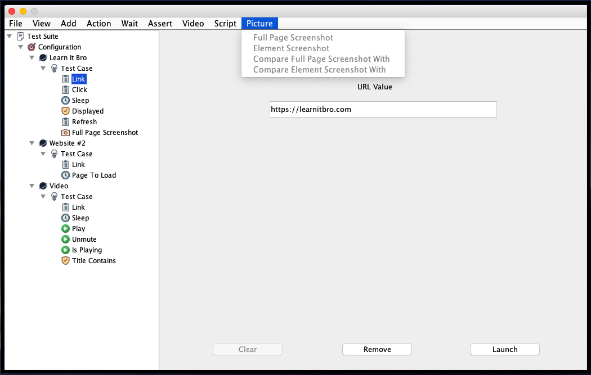

#  Mozz - Gotta Test It Bro

### Description: 
Test any website with a click of a button (open source tool developed by [learnitbro.com](https://learnitbro.com/))

### Summary:
This testing tool allows to create automated tests using a user interface

### Steps:
Using the user interface:
- Run the jar file
- Add test steps
- Press Launch
- The test will start and a report will be send to the email provided

Using the terminal or jenkins:
- Run the jar file and pass the json tree as a parameter
- Example: java -jar tool.jar tree.json
- The file will include the browser, test cases and all information the test needs
- The test will start and a report will be send to the email provided

### Supports:
Web Browsers:
- Chrome, Firefox, Internet Explorer, Edge, Safari and Opera
- Headless: Chrome and Firefox
 
Visual Testing:
- Full page screenshot comparison 
- Element screenshot comparison
 
Video:
- Video testing for default browser videos

Script:
- JavaScript execution

### In Progress
Video:
- Custom video testing

Mobile Browsers:
- Chrome (Android) and Safari (iOS)

Mobile Apps:
- Android and iOS

User Interface:
- Change test's order

### Requirements:
- Java 8
- Appium 7 (for mobile only) - to be supported soon

### Dependencies:
- Selenium 3.141.59
- Extent Reports 4.0.6
- TestNG 6.9.9
- WebDriverManager 3.8.1
- Appium 7.3.0
- Ashot 1.5.2
- Java Mail 1.4.0
- Gson 2.8.4
- Json 20180813
- JUnit 3.8.1
- JImageHash 3.0.0
- H2 Database 1.4.197 

### References:
Icons by [Dryicons.com](https://dryicons.com/)

Reports by [Extentreports.com](https://extentreports.com/)

Web Testing by Selenium [Selenium.dev](https://selenium.dev/)

Mobile Testing by Appium [Appium.io](https://appium.io/)

Also refer to TestNG, WebDriverManager, Ashot, Java Mail, Gson, Json, JUnit, JImageHash, H2 Database Libraries

For more information, refer to [Learnitbro.com](https://learnitbro.com/) 

### Build:
mvn package (Maven)
